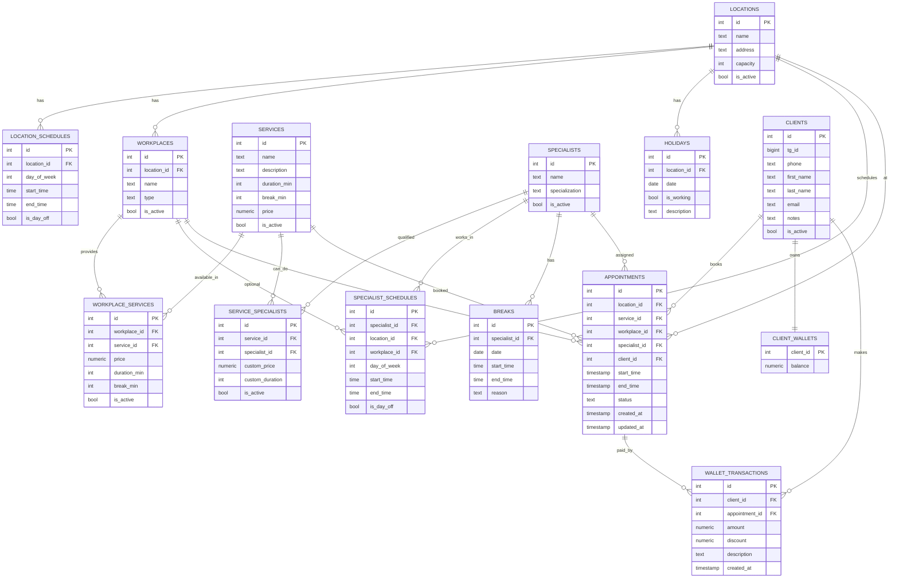

| Данные                                              | Где хранить | Зачем                      |
| --------------------------------------------------- | ----------- | -------------------------- |
| Справочники (услуги, специалисты, клиенты, локации) | PostgreSQL  | Истина, долговечные данные |
| Финансы (wallet, transactions)                      | PostgreSQL  | Истина, нужна точность     |
| Графики и слоты                                     | PostgreSQL  | Истина                     |
| Быстрая проверка слотов                             | Redis       | Кэш + блокировки           |
| Предварительное бронирование                        | Redis       | TTL + предотвращение гонок |
| Уведомления / события                               | Redis       | Pub/Sub                    |
| Сессии пользователей                                | Redis       | Временное хранилище        |

