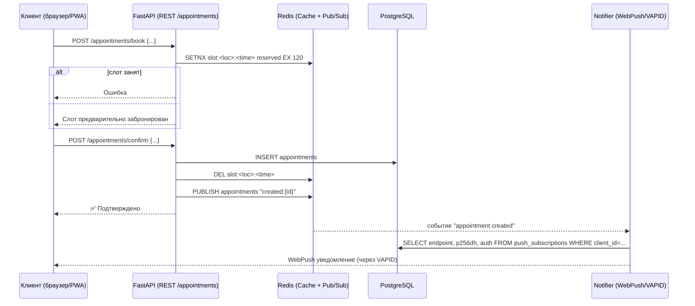

# Система записи

## Оглавление

* [Введение](#введение)
* [Архитектура](#архитектура)
* [Установка](#установка)
* [Веб-интерфейсы](#веб-интерфейсы)
  * [Админ-панель](#админ-панель)
  * [Пользовательский сайт](#пользовательский-сайт)
  * [Telegram-бот и Mini App](#telegram-бот-и-mini-app)
* [Backend и API](#backend-и-api)
* [Работа с клиентами](#работа-с-клиентами)
* [Финансы и CRM](#финансы-и-crm)
* [Примеры использования](#примеры-использования)
  * [Базовый пример](#базовый-пример)
  * [Продвинутый пример](#продвинутый-пример)
* [Дальнейшие планы](#дальнейшие-планы)
* [Процесс бронирования](#процесс-бронирования)
* [Структура базы данных](#структура-базы-данных)
* [Runtime расчёт слотов](#runtime-расчёт-слотов)
* [Механика пересчёта при изменениях](#механика-пересчёта-при-изменениях)

---


## Введение

**Система записи** — комплексное решение для организаций, работающих по предварительной записи.
Объединяет три пользовательских канала:

* Админ-панель
* Онлайн-сайт (Vue)
* Telegram-бот (единый, с маршрутизацией по ролям)

Система построена на дискретной временной сетке и поддерживает надёжную конкуренцию за слоты через Redis.

---

## Архитектура

**PostgreSQL / SQLite** — хранение основной информации (локации, услуги, специалисты, бронирования).
**Redis** — слоты, кэш, блокировки, очереди.
**Vue.js** — клиентский сайт.
**Telegram Mini App** — интерфейс для клиентов, админов и специалистов.

<details>
  <summary>Нажмите, чтобы увидеть подробности</summary>


| Данные              | Где хранить   | Зачем                |
| ------------------- | ------------- | -------------------- |
| Справочники         | PostgreSQL    | Истина               |
| Услуги, специалисты | PostgreSQL    | Истина               |
| Графики             | PostgreSQL    | Истина               |
| Runtime‑слоты       | Redis         | Быстрый доступ       |
| Блокировки слотов   | Redis         | Предотвращение гонок |
| Уведомления         | Redis Pub/Sub | Реактивность         |

</details>
---


## Установка

<details>
  <summary>Нажмите, чтобы увидеть инструкции</summary>

1. Установить зависимости: PostgreSQL, Redis, Python 3.11+, Node 18+.
2. Настроить переменные окружения.
3. Применить миграции.
4. Запустить backend и фронтенд.

</details>

---

## Веб-интерфейсы

### Админ-панель

* управление объектами, комнатами, услугами;
* графики специалистов;
* создание override;
* ручные сложные брони.

### Пользовательский сайт (Vue)

* выбор услуги, объекта, специалиста;
* просмотр слотов на 60 дней;
* онлайн-бронирование.

### Telegram-бот и Mini App

* единый бот;
* сценарии по роли пользователя;
* клиент: запись;
* специалист: расписание и операции;
* админ: управление.

---

## Backend и API

* FastAPI;
* PostgreSQL;
* Redis для слотов;
* JWT или аналог авторизации;
* API для Vue и Telegram Mini App.

---

## Работа с клиентами

* регистрация;
* персональные скидки;
* покупка и списание пакетов;
* уведомления через Telegram и WebPush.

---

## Финансы и CRM

* кошельки (`client_wallets`);
* транзакции (`wallet_transactions`);
* привязка транзакций к бронированиям.

---

## Примеры использования

### Базовый пример

1. Админ создаёт услугу.
2. Клиент выбирает слот.
3. Система фиксирует бронь.
4. Уведомление отправляется автоматически.

### Продвинутый пример

1. Клиент покупает пакет услуг.
2. При записи услуга списывается из пакета.
3. Система проверяет слоты и применяет скидки.

---

## Дальнейшие планы

* графический редактор расписаний;
* расширенная аналитика;
* интеграции с внешними календарями;
* автоматизация напоминаний.

---

## Процесс бронирования



---

</details>

<details>
<summary>Нажмите, чтобы увидеть подробности</summary>

## Структура базы данных

### Users (универсальная модель)

* единая сущность для клиентов, специалистов, админов;
* роли: через `user_roles`;
* контакты: email, телефон, tg_id, tg_username;
* профиль клиента и специалиста расширяется через соответствующие таблицы.

### Основные таблицы

* `company` — единая компания;
* `locations` — объекты;
* `rooms` — кабинеты;
* `services` — услуги (длительность, break, цена);
* `service_rooms` — какие услуги можно оказывать в каких комнатах;
* `service_packages` — пакеты услуг (JSON-состав);
* `specialists` — профиль специалиста;
* `specialist_services` — компетенции;
* `calendar_overrides` — единая таблица блокировок;
* `bookings` — записи на услуги;
* `booking_discounts` — разовые скидки;
* `client_packages`, `client_discounts`;
* `client_wallets`, `wallet_transactions`;
* `push_subscriptions` — WebPush подписки.

---

</details>

# Runtime расчёт слотов

## 1. Дискретная временная сетка

* шаг: **15 минут** (96 слотов в сутки);
* длительность услуги округляется вверх к шагу;
* break услуги округляется вверх отдельно;
* фактические значения сохраняются в `bookings`.

## 2. Расчёт на 60 дней вперёд

Система заранее рассчитывает слоты на **60 дней**.
Каждый день — отдельная сетка из 96 ячеек.

## 3. Алгоритм расчёта дня

1. grid[96] = свободно;
2. применить график `locations`;
3. применить график `specialists`;
4. применить `calendar_overrides`;
5. применить существующие брони (`duration + break`);
6. сохранить результат в Redis.

## 4. Redis хранение

Ключ: `slots_preview:{specialist}:{date}`.
TTL: **12–24 часа**.
Инвалидация при: изменение графика, override, услуга, бронь.

---

# Механика пересчёта при изменениях

## 1. Что вызывает пересчёт?

* изменение графика локации → пересчёт всех 60 дней;
* изменение графика специалиста → пересчёт 60 дней;
* новый override → пересчёт affected-дней;
* новая бронь → пересчёт одного дня;
* отмена/перенос брони → пересчёт одного дня;
* изменение duration/break услуги → полный пересчёт связанных специалистов.

## 2. Как пересчитывается конкретный день?

Через внутренний сервисный вызов:

```
SlotEngine.recalc(specialist_id, date)
```

Формируется новая сетка из 96 слотов и сохраняется в Redis.

## 3. Универсальный callback

```
POST /internal/slots/recalc
{
  "specialist_id": 17,
  "dates": ["2025-03-01", "2025-03-02"]
}
```

Используется только внутри backend.

---


Инструкция по использованию системы записи:

1. Администратор настраивает локации, комнаты, услуги и специалистов.
2. Система рассчитывает слоты на 60 дней вперёд.
3. Клиент или администратор выполняет запись через веб/Telegram.
4. Redis обеспечивает мгновенный доступ и конкуренцию при бронировании.
5. Любое изменение в графике или блокировке вызывает пересчёт только нужных дней.


