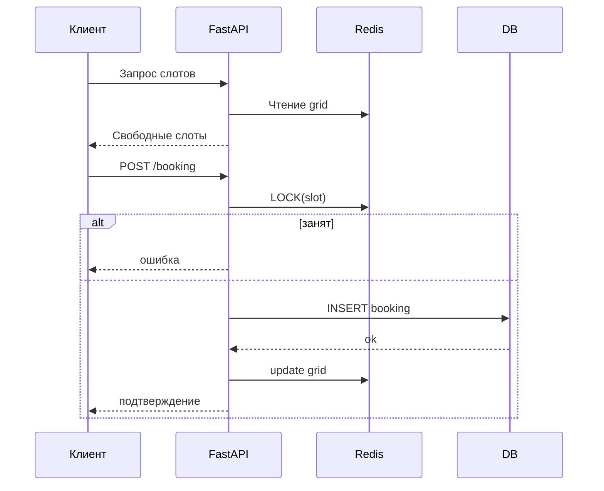

# Система записи

## Оглавление

* [Введение](#введение)
* [Архитектура](#архитектура)
* [Установка](#установка)
* [Веб-интерфейсы](#веб-интерфейсы)
  * [Админ-панель](#админ-панель)
  * [Пользовательский сайт](#пользовательский-сайт)
  * [Telegram-бот и Mini App](#telegram-бот-и-mini-app)
* [Backend и API](#backend-и-api)
* [Работа с клиентами](#работа-с-клиентами)
* [Финансы и CRM](#финансы-и-crm)
* [Примеры использования](#примеры-использования)
  * [Базовый пример](#базовый-пример)
  * [Продвинутый пример](#продвинутый-пример)
* [Дальнейшие планы](#дальнейшие-планы)
* [Процесс бронирования](#процесс-бронирования)
* [Структура базы данных](#структура-базы-данных)
* [Runtime расчёт слотов](#runtime-расчёт-слотов)
* [Механика пересчёта при изменениях](#механика-пересчёта-при-изменениях)

---

## Введение

**Система записи** — комплексное решение для организаций, работающих по предварительной записи.
Единые каналы работы:

* Админ‑панель
* Клиентский сайт (Vue)
* Telegram Mini App (единый бот c маршрутизацией по ролям)

Основой является **дискретная сетка 15 минут** и **Redis‑движок для быстрого расчёта слотов и конкуренции**.

---

## Архитектура

**PostgreSQL** — источник истины.
**Redis** — слоты, блокировки, уведомления.
**Vue.js** — клиентская запись.
**Telegram Mini App** — интерфейсы клиент/специалист/админ.

<details>
<summary>Нажмите, чтобы увидеть подробности</summary>

| Данные              | Где хранить   | Назначение           |
| ------------------- | ------------- | -------------------- |
| Справочники         | PostgreSQL    | Истина               |
| Услуги, специалисты | PostgreSQL    | Истина               |
| Графики (JSON)      | PostgreSQL    | Истина               |
| Runtime‑слоты       | Redis         | Быстрый доступ       |
| Блокировки слотов   | Redis         | Предотвращение гонок |
| Уведомления         | Redis Pub/Sub | Событийность         |

---

</details>


## Установка

<details>
<summary>Нажмите, чтобы увидеть подробности</summary>

1. PostgreSQL + Redis
2. Настройка переменных окружения
3. Применение миграций
4. Запуск backend и frontend

---
</details>


## Веб-интерфейсы

### Админ‑панель Telegram

* управление объектами, комнатами, услугами;
* создание override;
* графики специалистов;
* сложные брони.

### Клиентский сайт (Vue)

* выбор услуги/специалиста;
* быстрый просмотр слотов на 60 дней;
* онлайн‑запись.

### Telegram Mini App

* единый бот;
* маршрутизация по ролям;
* клиент: запись/отмена;
* специалист: расписание/блокировки;
* админ: управление сущностями.

---

## Backend и API

* FastAPI
* SQLite/PostgreSQL
* Redis
* Авторизация (password/tg)
* API для Vue и Telegram Mini App

---

## Работа с клиентами

* users — единая сущность (client/specialist/admin)
* хранение tg_id, tg_username, телефона, email
* персональные скидки (`client_discounts`)
* пакеты (`client_packages`)
* автоматические уведомления

---

## Финансы и CRM

* `client_wallets` — баланс клиента
* `wallet_transactions` — операции (deposit/payment/refund)
* связь транзакций с `bookings`

---

## Примеры использования

<details>
<summary>Нажмите, чтобы увидеть подробности</summary>

### Базовый пример

1. Клиент выбирает услугу
2. Система отдаёт слоты (60 дней)
3. Клиент бронирует
4. Уведомления отправляются

### Продвинутый пример

1. Клиент покупает пакет услуг
2. При записи уменьшается остаток пакета
3. Система автоматически применяет скидки

---

</details>


## Дальнейшие планы

<details>
<summary>Нажмите, чтобы увидеть подробности</summary>

* визуальный редактор расписаний
* аналитика загрузки
* интеграции с внешними календарями
* автоматизация напоминаний

</details>

---

## Процесс бронирования

<details>
<summary>Нажмите, чтобы увидеть подробности</summary>

### Диаграмма



---

</details>


## Структура базы данных

<details>
<summary>Нажмите, чтобы увидеть подробности</summary>

### Users (универсальная сущность)

* клиенты, специалисты, админы — все в одной таблице `users`;
* роли через `user_roles`;
* tg_id, tg_username, phone, email;
* birth_date, gender, notes.

### Основные таблицы

* `company` — единая компания;
* `locations` — включая `work_schedule JSONB`;
* `rooms`;
* `services` (duration, break, price);
* `service_rooms`;
* `service_packages` — **JSON-состав пакета**;
* `specialists` — `work_schedule JSONB`;
* `specialist_services`;
* `calendar_overrides`;
* `bookings` — с duration+break, фиксируемыми при создании;
* `booking_discounts`;
* `client_packages`;
* `client_discounts`;
* `client_wallets`;
* `wallet_transactions`;
* `push_subscriptions`.

### Пример JSON-графика (локация или специалист)

```
{
  "0": [["09:00","18:00"]],
  "1": [["09:00","12:00"],["14:00","20:00"]],
  "6": []
}
```

---

</details>


# Runtime расчёт слотов

<details>
<summary>Нажмите, чтобы увидеть подробности</summary>

## Расчёт на 60 дней

* система всегда рассчитывает слоты **на 60 дней вперёд**;
* каждый день — отдельный grid из 96 слотов;
* в Redis хранится по одному ключу на каждый день.

## 1. Сетка

* шаг 15 минут (96 ячеек);
* округление duration и break вверх.

## 2. Алгоритм расчёта дня

1. grid = свободно;
2. применить work_schedule (локация);
3. применить work_schedule (специалист);
4. применить overrides;
5. применить bookings (duration + break);
6. сохранить в Redis (слоты одного дня).

## 3. Redis

* ключ: `slots_preview:{spec}:{date}`;
* TTL: 12–24ч;
* инвалидация только затронутых дней.

---

</details>


# Механика пересчёта при изменениях

<details>
<summary>Нажмите, чтобы увидеть подробности</summary>

## Когда пересчитываем?

* изменение графика локации → 60 дней;
* изменение графика специалиста → 60 дней;
* override → только affected-даты;
* новая/отменённая бронь → 1 день;
* изменение услуги → пересчитать все даты специалистов, оказывающих услугу.

## Redis-lock в процессе бронирования

```
1. Клиент запрашивает слоты
2. API возвращает grid
3. Клиент выбирает слот
4. API → Redis: LOCK(slots)
5. API повторно проверяет слоты
6. Создаёт запись в bookings
7. Сохраняет duration+break
8. Обновляет Redis grid
9. Освобождает LOCK
```

Без redis-lock возможны гоночные условия.

## Callback пересчёта

```
POST /internal/slots/recalc
{
  "specialist_id": 17,
  "dates": ["2025-03-01","2025-03-02"]
}
```

</details>

