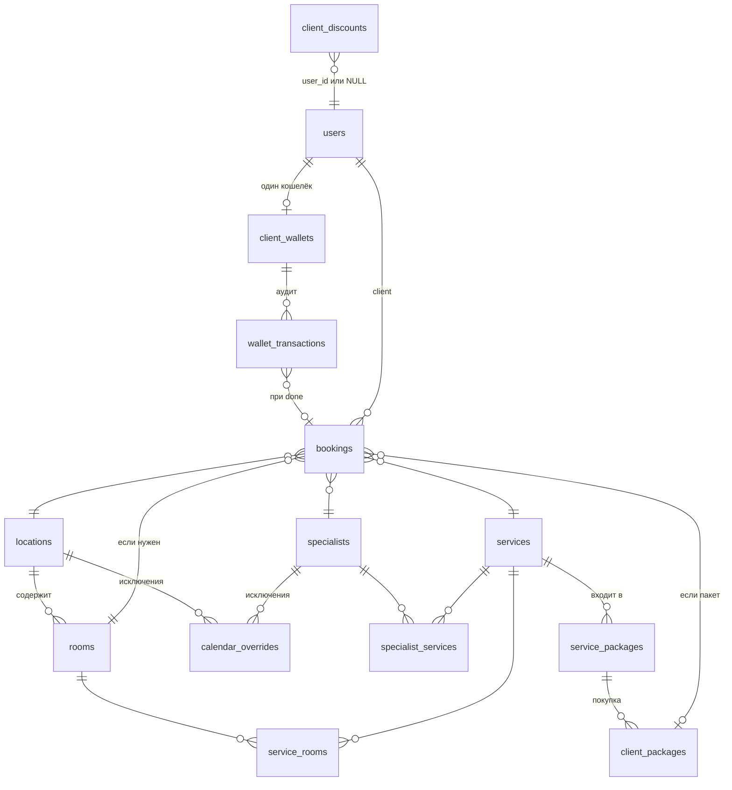

# Контракт системы записи

Единый документ принципов. Конкретика — в профильных документах.

---

## 1. Архитектура — три блока

```mermaid
classDiagram
  class ВРЕМЯ {
    Локации (расписание)
    Специалисты (график)
    Кабинеты
    Calendar overrides
    --
    Выход: доступные окна
    (время + кто)
  }

  class УСЛУГИ {
    Услуги (цена, время)
    Пакеты / Пресеты
    Скидки
  }

  class ДЕНЬГИ {
    <<автономный>>
    Кошелёк
    Транзакции (аудит)
    --
    Не знает про слоты
    расписание, кабинеты
  }

  class Booking {
    <<мост>>
    пресет + специалист
    локация + кабинет
    клиент + время
    --
    pending → confirmed
    → done / cancelled / no_show
  }

  ВРЕМЯ <.. Booking : duration\nservice_ids
  УСЛУГИ <.. Booking : пресет\nцена
  УСЛУГИ --> ДЕНЬГИ : done · purchase\nrefund · correction
```

**Границы между блоками:**

- **ВРЕМЯ ↔ УСЛУГИ:** Блок ВРЕМЯ получает от Блока УСЛУГИ только **суммарную длительность** + **список service_id** (для фильтра специалистов). Цены, пакеты, скидки — не знает.
- **УСЛУГИ → ДЕНЬГИ:** Блок ДЕНЬГИ — отдельный, параллельный процесс. Ему не важно откуда пришёл триггер (`done`, продажа пакета, возврат, ручная корректировка). Он обрабатывает финансовые операции и ведёт аудит. Не знает про слоты, расписание, кабинеты.
- **Направление:** ВРЕМЯ и УСЛУГИ работают синхронно (запись). ДЕНЬГИ работают асинхронно — постфактум, по событиям.

---

## 2. Сущности

### Блок ВРЕМЯ

| Сущность | Назначение | Ключевые поля |
|----------|------------|---------------|
| **Локация** | Физическая точка. Базовая сетка слотов (фаза 1) | `work_schedule` (JSON), кабинеты |
| **Кабинет** | Ресурс внутри локации. Привязан к услугам (`service_rooms`) | Проверяется свободность при записи |
| **Специалист** | Исполнитель. Свой график (пересечение с локацией) | `work_schedule` (JSON), `specialist_services` |
| **Calendar overrides** | Исключения для любой сущности | `target_type` (location/room/specialist), `override_kind` (day_off, block, ...) |

### Блок УСЛУГИ

| Сущность | Назначение | Ключевые поля |
|----------|------------|---------------|
| **Услуга** | Атомарная единица | `duration_min`, `break_min`, `price`, `price_5`, `price_10` |
| **Пакет / Пресет** | Единая таблица `service_packages` (см. ниже) | `package_items` (JSON), `package_price`, `qty`, `show_on_pricing`, `show_on_booking` |
| **Скидка** | Индивидуальная или акционная | `client_discounts`: `user_id`, `discount_percent`, `valid_from/valid_to` |

**Пакет vs Пресет** (одна таблица `service_packages`):

| | Пресет (qty=1) | Пакет (qty=5/10) |
|---|---|---|
| **Что это** | Единица выбора на UI записи | Товар для продажи (финансы, кошелёк) |
| **Видимость** | `show_on_booking` | `show_on_pricing` |
| **Цена** | Сумма цен услуг (информационная) | Рассчитывается из `price_5`/`price_10` услуг (оптовая скидка) |
| **Пример** | «Антицеллюлитный комплекс» (LPG + прессотерапия) | «LPG 10 сеансов» |

### Блок ДЕНЬГИ (автономный)

Отдельный процесс, параллельный основному. Не знает про расписание, слоты, кабинеты. Реагирует на события:

| Событие | Операция |
|---------|----------|
| Продажа пакета | `deposit` на сумму пакета |
| Booking → `done` (пакет есть) | `withdraw` на unit_price |
| Booking → `done` (без пакета) | `deposit` + `withdraw` (аудит разовой услуги) |
| Возврат остатка пакета | `withdraw` на remaining × unit_price |
| Ручная корректировка | `correction` (±) |

| Сущность | Назначение |
|----------|------------|
| **Кошелёк** (`client_wallets`) | Баланс клиента. Одна запись на клиента |
| **Транзакции** (`wallet_transactions`) | Иммутабельный аудит всех операций |

Блоку ДЕНЬГИ не важен источник триггера — бот, web, админка. Он получает команду (deposit/withdraw/refund/correction) и выполняет.

Детали: [`docs/wallet.md`](wallet.md)

### Мост: Сеанс (Booking)

Booking — единовременное посещение, связывает оба блока:

- Может включать одну или несколько услуг (через пресет)
- Общее время = `sum(duration + break)` по всем услугам → UI показывает итоговое время
- Привязан к: пресет/услуга + специалист + локация + кабинет + клиент + время
- Жизненный цикл: `pending` → `confirmed` → `done` / `cancelled` / `no_show`
- `done` → триггер Блока ДЕНЬГИ

**Комплекс ≠ пакет:** комплекс (пресет из нескольких услуг) — разовая покупка по полным ценам. Пакет — предоплаченный набор N сеансов по оптовой цене.

---

## 3. Расчёт слотов (Блок ВРЕМЯ)

### Фаза 1 — базовая сетка (Redis, кеш)

- **Вход:** `locations.work_schedule` + `calendar_overrides` (target=location)
- **Шаг:** 15 минут
- **Результат:** ZSET доступных времён (`time_str` → `expire_ts`)
- **НЕ учитывает:** услуги, специалистов, бронирования, кабинеты

### Фаза 2 — доступность по пресету/услуге (runtime)

- **Вход:** фаза 1 + пресет (список услуг) + дата

```
total_time = sum(duration + break) по всем услугам пресета
slots_needed = ceil(total_time / 15)

Слот доступен =
    время ∈ сетка_локации (фаза 1)
  ∩ время ∈ график_специалиста
  ∩ специалист оказывает ВСЕ услуги пресета
  ∩ consecutive slots свободны (slots_needed подряд)
  ∩ нет пересечения с бронированиями специалиста
  ∩ кабинет свободен на весь период
```

**UI:** время начала + общая длительность (например «10:00 — 2 ч»)

Детали: [`docs/booking.md`](booking.md)

---

## 4. Прайс и Flow записи

**Прайс** — витрина (доска объявлений). Показывает услуги и пакеты с флагом `show_on_pricing`. Из прайса можно перейти в запись.

### Flow 1 — из прайса

```
Выбрал пресет на прайсе → пресет уже определён → дата → время → специалист
```

### Flow 2 — из записи

```
Список пресетов (qty=1, show_on_booking) → выбрал → дата → время → специалист
```

---

## 5. Ценообразование и скидки

### Уровни цен

| Тип | Источник цены | Когда применяется |
|-----|---------------|-------------------|
| **Разовая** | `services.price` | Одиночная запись без пакета |
| **Пакетная (5 сеансов)** | `services.price_5` | Расчёт `package_price` для qty=5 |
| **Пакетная (10 сеансов)** | `services.price_10` | Расчёт `package_price` для qty=10 |

Цена пакета рассчитывается автоматически из `price_5`/`price_10` услуг, входящих в пакет.

### Скидки

| Тип | Механизм | Хранение |
|-----|----------|----------|
| **Пакетная** | Оптовая цена через `price_5`/`price_10` | `services` |
| **Индивидуальная** | Персональная скидка клиента | `client_discounts` (`user_id` задан) |
| **Акционная** | Скидка для всех клиентов | `client_discounts` (`user_id = NULL`) |

**Правило: скидки НЕ совмещаются.** Применяется одна — максимальная из доступных:
- Если клиент использует пакет → применяется пакетная цена (price_5/price_10)
- Если без пакета → проверяются индивидуальная и акционная скидки, берётся максимальная

Детали: [`docs/wallet.md`](wallet.md)

---

## 6. Связи между таблицами


