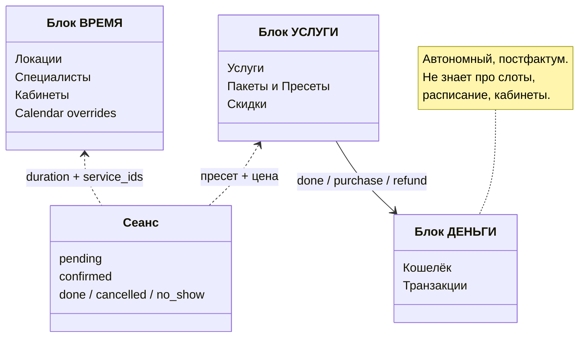
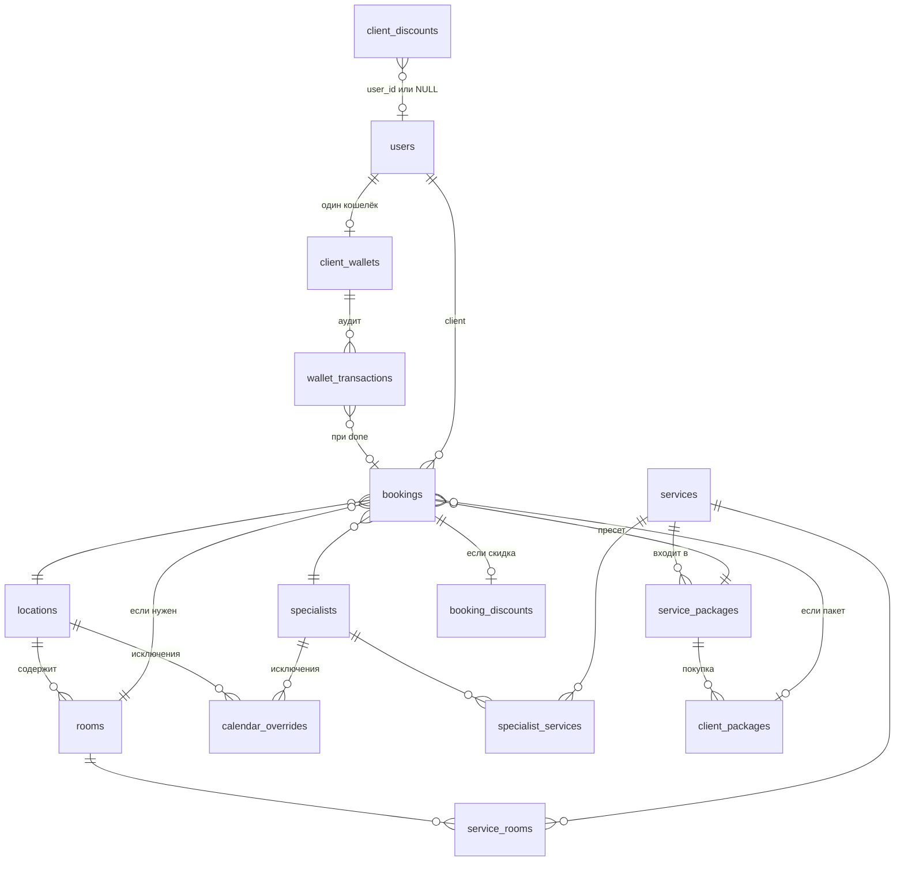

# Контракт системы записи

Единый документ принципов. Конкретика — в профильных документах.

---

## 1. Архитектура — три блока



**Границы между блоками:**

- **ВРЕМЯ ↔ УСЛУГИ:** Блок ВРЕМЯ получает от Блока УСЛУГИ только **суммарную длительность** + **список service_id** (для фильтра специалистов). Цены, пакеты, скидки — не знает.
- **УСЛУГИ → ДЕНЬГИ:** Блок ДЕНЬГИ — отдельный, параллельный процесс. Ему не важно откуда пришёл триггер (`done`, продажа пакета, возврат, ручная корректировка). Он обрабатывает финансовые операции и ведёт аудит. Не знает про слоты, расписание, кабинеты.
- **Направление:** ВРЕМЯ и УСЛУГИ работают синхронно (запись). ДЕНЬГИ работают асинхронно — постфактум, по событиям.

---

## 2. Сущности

### Блок ВРЕМЯ

| Сущность | Назначение | Ключевые поля |
|----------|------------|---------------|
| **Локация** | Физическая точка. Базовая сетка слотов (фаза 1) | `work_schedule` (JSON), кабинеты |
| **Кабинет** | Ресурс внутри локации. Привязан к услугам (`service_rooms`) | Проверяется свободность при записи |
| **Специалист** | Исполнитель. Свой график (пересечение с локацией) | `work_schedule` (JSON), `specialist_services` |
| **Calendar overrides** | Исключения для любой сущности | `target_type` (location/room/specialist), `override_kind` (day_off, block, ...) |

### Блок УСЛУГИ

| Сущность | Назначение | Ключевые поля |
|----------|------------|---------------|
| **Услуга** | Атомарная единица | `duration_min`, `break_min`, `price`, `price_5`, `price_10` |
| **Пакет / Пресет** | Единая таблица `service_packages` (см. ниже) | `package_items` (JSON), `show_on_pricing`, `show_on_booking` |
| **Скидка** | Индивидуальная или акционная | `client_discounts`: `user_id`, `discount_percent`, `valid_from/valid_to` |

**Пакет vs Пресет** (одна таблица `service_packages`):

Различаются по `sum(quantity)` в `package_items` — отдельного поля `qty` нет:

| | Пресет (sum qty = 1) | Пакет (sum qty = 5/10) |
|---|---|---|
| **Что это** | Единица выбора на UI записи | Товар для продажи (финансы, кошелёк) |
| **Видимость** | `show_on_booking` | `show_on_pricing` |
| **Цена (витрина)** | Вычисляется: `sum(service.price)` | Вычисляется: `sum(qty × service.price_N)` |
| **Цена (покупка)** | — | Фиксируется в `client_packages` при продаже |
| **Пример** | «Антицеллюлитный комплекс» (LPG + прессо) | «LPG 10 сеансов» |

`package_price` не хранится в `service_packages` — вычисляется динамически из `price_5`/`price_10` услуг. Фиксируется только при покупке (в `client_packages.purchase_price`).

### Блок ДЕНЬГИ (автономный)

Отдельный процесс, параллельный основному. Не знает про расписание, слоты, кабинеты. Реагирует на события:

| Событие | Операция |
|---------|----------|
| Продажа пакета | `deposit` на сумму пакета |
| Booking → `done` (пакет есть) | `withdraw` на unit_price |
| Booking → `done` (без пакета) | `deposit` + `withdraw` (аудит разовой услуги) |
| Возврат остатка пакета | `withdraw` на remaining × unit_price |
| Ручная корректировка | `correction` (±) |

| Сущность | Назначение |
|----------|------------|
| **Кошелёк** (`client_wallets`) | Баланс клиента. Одна запись на клиента |
| **Транзакции** (`wallet_transactions`) | Иммутабельный аудит всех операций |
| **Разовая скидка** (`booking_discounts`) | Ручная скидка от админа на конкретную запись (`discount_percent`, `discount_reason`). Не связана с `client_discounts` |

Блоку ДЕНЬГИ не важен источник триггера — бот, web, админка. Он получает команду (deposit/withdraw/refund/correction) и выполняет.

Детали: [`docs/wallet.md`](wallet.md)

### Мост: Сеанс (Booking)

Booking — единовременное посещение, связывает оба блока. **Один booking = один пресет.**

- Привязан к: **`service_package_id`** (пресет) + специалист + локация + кабинет + клиент + время
- Общее время = `sum(duration + break)` по всем услугам пресета → снимок в `duration_minutes`, `break_minutes`
- Жизненный цикл: `pending` → `confirmed` → `done` / `cancelled` / `no_show`
- `done` → триггер Блока ДЕНЬГИ (+ запись в `booking_discounts` если скидка)

**Комплекс ≠ пакет:** комплекс (пресет из нескольких услуг) — разовая покупка по полным ценам. Пакет — предоплаченный набор N сеансов по оптовой цене.

---

## 3. Расчёт слотов (Блок ВРЕМЯ)

### Фаза 1 — базовая сетка (Redis, кеш)

- **Вход:** `locations.work_schedule` + `calendar_overrides` (target=location)
- **Шаг:** 15 минут
- **Результат:** ZSET доступных времён (`time_str` → `expire_ts`)
- **НЕ учитывает:** услуги, специалистов, бронирования, кабинеты

### Фаза 2 — доступность по пресету/услуге (runtime)

- **Вход:** фаза 1 + пресет (список услуг) + дата

```
total_time = sum(duration + break) по всем услугам пресета
slots_needed = ceil(total_time / 15)

Слот доступен =
    время ∈ сетка_локации (фаза 1)
  ∩ время ∈ график_специалиста
  ∩ специалист оказывает ВСЕ услуги пресета
  ∩ consecutive slots свободны (slots_needed подряд)
  ∩ нет пересечения с бронированиями специалиста
  ∩ кабинет свободен на весь период
```

**UI:** время начала + общая длительность (например «10:00 — 2 ч»)

Детали: [`docs/booking.md`](booking.md)

---

## 4. Прайс и Flow записи

### UI-принцип

**Прайс** — про деньги. Показывает цены, указывает общее время. Фильтрует пакеты/пресеты по `show_on_pricing`.

**Запись** — про время. Показывает доступные окна, указывает цену для ориентира (можно минимальную сумму). Фильтрует пресеты по `show_on_booking`. В момент записи точная цена не важна — важно время.

### Flow 1 — из прайса

```
Выбрал пресет на прайсе → пресет уже определён → дата → время → специалист
```

### Flow 2 — из записи

```
Список пресетов (show_on_booking) → выбрал → дата → время → специалист
```

---

## 5. Ценообразование и скидки

### Уровни цен

| Тип | Источник цены | Когда применяется |
|-----|---------------|-------------------|
| **Разовая** | `services.price` | Одиночная запись без пакета |
| **Пакетная (5 сеансов)** | `services.price_5` | Расчёт `package_price` для qty=5 |
| **Пакетная (10 сеансов)** | `services.price_10` | Расчёт `package_price` для qty=10 |

Цена пакета **не хранится** — вычисляется динамически из `price_5`/`price_10` услуг + `package_items`. Фиксируется только при покупке (`client_packages.purchase_price`).

### Скидки

| Тип | Механизм | Хранение |
|-----|----------|----------|
| **Пакетная** | Оптовая цена через `price_5`/`price_10` | `services` |
| **Индивидуальная** | Персональная скидка клиента | `client_discounts` (`user_id` задан) |
| **Акционная** | Скидка для всех клиентов | `client_discounts` (`user_id = NULL`) |
| **Разовая** | Ручная скидка от админа на конкретную запись | `booking_discounts` |

**Правило: скидки НЕ совмещаются.** Применяется одна — максимальная из доступных:
- Если клиент использует пакет → применяется пакетная цена (price_5/price_10)
- Если без пакета → проверяются индивидуальная, акционная и разовая скидки, берётся максимальная

Детали: [`docs/wallet.md`](wallet.md)

---

## 6. Связи между таблицами


